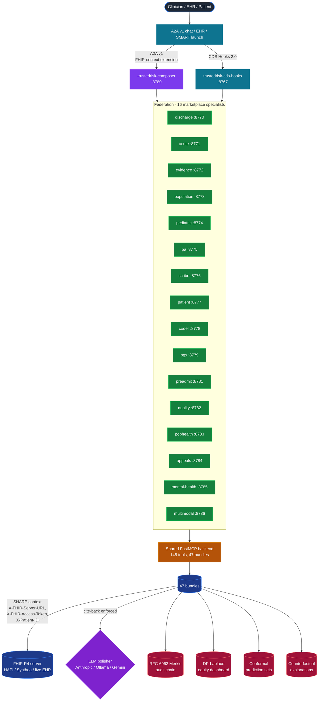
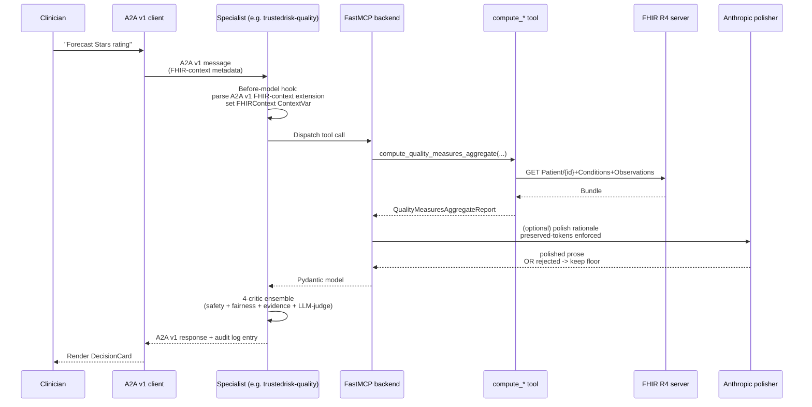
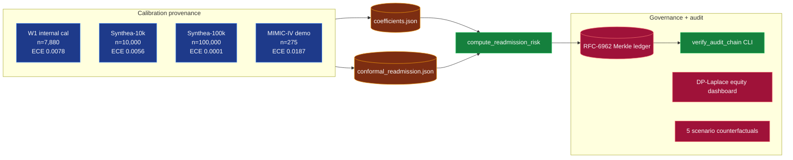
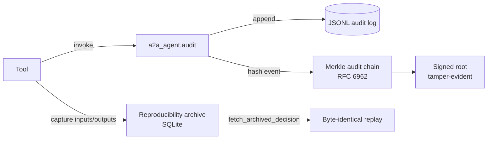
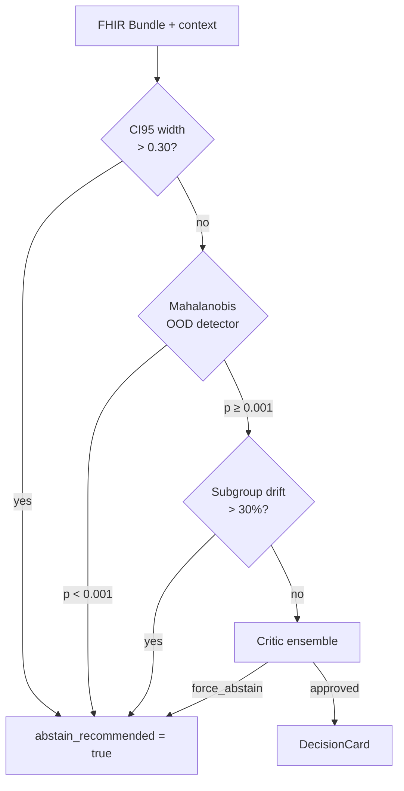

# TrustedRisk Architecture

**Audience**: developers integrating TrustedRisk into a workspace,
clinical informaticists adopting the federation, regulators reviewing
the SaMD posture.

**Snapshot (2026-04-30)**: 145 MCP tools / 47 thematic
bundles / 16 federation specialists + composer + cds_hooks + master
MCP / **4,156 tests passing**.

**Visual diagrams below** are Mermaid blocks -- render on GitHub or
any Markdown viewer with Mermaid support.

## 0. Federation topology (Mermaid)



## 0.1 SHARP-on-MCP request flow (Mermaid)



## 0.2 Calibration + audit pipeline (Mermaid)



---

---

## §1. Federation overview

```mermaid
flowchart TB
  subgraph "A2A v1 workspace"
    User[User / clinician]
    BYO[BYO orchestrator agent<br/>(consults via dropdown)]
  end

  User -->|chat| BYO

  subgraph "TrustedRisk federation specialists (Phase 1 + 2 + 7)"
    Discharge[trustedrisk-discharge<br/>:8770]
    Acute[trustedrisk-acute<br/>:8771]
    Evidence[trustedrisk-evidence<br/>:8772]
    Population[trustedrisk-population<br/>:8773]
    PediMH[trustedrisk-pedi-mh<br/>:8774]
    PA[trustedrisk-pa<br/>:8775]
    Scribe[trustedrisk-scribe<br/>:8776]
    Patient[trustedrisk-patient<br/>:8777]
    Coder[trustedrisk-coder<br/>:8778]
    Pgx[trustedrisk-pgx<br/>:8779]
    Composer[trustedrisk-composer<br/>:8780]
    Preadmit[trustedrisk-preadmit<br/>:8781]
  end

  BYO -->|A2A consult| Discharge
  BYO -->|A2A consult| Acute
  BYO -->|A2A consult| Evidence
  BYO -->|A2A consult| Population
  BYO -->|A2A consult| PediMH
  BYO -->|A2A consult| PA
  BYO -->|A2A consult| Scribe
  BYO -->|A2A consult| Patient
  BYO -->|A2A consult| Coder
  BYO -->|A2A consult| Pgx
  BYO -->|A2A consult| Composer
  BYO -->|A2A consult| Preadmit

  subgraph "Shared backend (one binary, swappable agent-card)"
    MCP[mcp_server.server<br/>FastMCP + SHARP middleware<br/>+ OAuth + Rate limit + OTel]
    Tools[79 MCP tools<br/>across 26 bundles]
    Audit[a2a_agent.audit<br/>+ Merkle chain]
    LLMPolish[a2a_agent.llm_polish<br/>Ollama / Gemini / null]
    Memory[a2a_agent.memory<br/>SQLite cards]
  end

  Discharge --> MCP
  Acute --> MCP
  Evidence --> MCP
  Population --> MCP
  PediMH --> MCP
  PA --> MCP
  Scribe --> MCP
  Patient --> MCP
  Coder --> MCP
  Pgx --> MCP
  Preadmit --> MCP
  Composer --> MCP

  MCP --> Tools
  MCP --> Audit
  Tools --> LLMPolish
  Tools --> Memory

  subgraph "EHR / FHIR R4"
    FHIR[FHIR server]
  end

  MCP -->|SHARP X-FHIR-* headers| FHIR
```

The 12 specialists (11 + composer) are deployed independently on
ports 8770-8781 but share the same MCP backend. Their agent-cards
differ -- each advertises a focused skill catalogue -- but the tool
registration is identical. This means:

- A workspace can register only the specialists it needs.
- Resource savings: scale-to-zero per specialist, free-tier Cloud Run
  sustains all 12 for $0/month at low traffic.
- A single coefficient bump propagates to every specialist
  automatically.

---

## §2. SHARP-on-MCP context flow

```mermaid
sequenceDiagram
  autonumber
  participant Client as A2A client (BYO orchestrator)
  participant Specialist as TrustedRisk specialist
  participant Middleware as SHARP middleware
  participant Tool as MCP tool
  participant FHIR as FHIR server

  Client->>Specialist: A2A message<br/>metadata.fhir-context = {fhirUrl, fhirToken, patientId, ...}
  Specialist->>Middleware: HTTP request with X-FHIR-* headers
  Middleware->>Middleware: Parse headers; bind FHIRContext (ContextVar)
  alt Missing required headers
    Middleware-->>Client: 403 missing_fhir_context
  end
  Middleware->>Tool: dispatch (rate-limited, OAuth-validated)
  Tool->>FHIR: fhirpy client bound to ctx
  alt 401 from FHIR
    Tool->>Tool: with_auth_retry -> refresh_fhir_token
    Tool->>FHIR: retry with new access_token
    alt Refresh failed
      Tool-->>Middleware: FhirAuthRequired
      Middleware-->>Client: 401 + AuthRequiredHint
    end
  end
  FHIR-->>Tool: FHIR Bundle
  Tool->>Tool: SHAP / cite-back / fairness audit
  Tool-->>Specialist: Pydantic schema response
  Specialist-->>Client: A2A reply
```

The `${fhir-context-extension-uri}` header on the A2A side maps 1-to-1
to the SHARP-on-MCP `X-FHIR-...` headers internally. Both code paths
populate the same `FHIRContext` ContextVar (`mcp_server/sharp/headers.py`),
so the rest of the runtime is transport-agnostic.

---

## §3. Critic ensemble

```mermaid
flowchart LR
  subgraph "Decision pipeline"
    DC[DecisionCard<br/>candidate] -->|critic_fn| EN[Ensemble]
  end

  EN --> CS[clinical_safety<br/>critic]
  EN --> FC[fairness<br/>critic]
  EN --> EC[evidence<br/>critic]
  EN --> LJ[llm_judge<br/>critic -- w/ deterministic floor]
  EN --> CON[constitutional<br/>critic -- Phase 7.4]

  CS --> AGG[Aggregator<br/>(most-conservative-wins)]
  FC --> AGG
  EC --> AGG
  LJ --> AGG
  CON --> AGG

  AGG -->|approved| OUT[Final DecisionCard]
  AGG -->|downgrade_confidence| OUT
  AGG -->|force_abstain| OUT
  AGG -->|request_replay| RV[Plan revision<br/>bounded retry]
  RV --> DC
```

Voting rule: any critic emitting `force_abstain` -> ensemble
`force_abstain`. Otherwise any `request_replay` (with retry budget)
-> replay. Otherwise ≥ 2 `downgrade_confidence` -> downgrade. Otherwise
approved.

---

## §4. Composer workflow execution

```mermaid
flowchart LR
  subgraph "WorkflowStep[N]"
    Inputs[input bindings<br/>${input.x} / ${steps.id.output.field}]
    Resolve[Resolver<br/>orchestrator._resolve_inputs]
    Inputs --> Resolve
  end

  Resolve --> Tool[Specialist tool call<br/>(in-process or A2A HTTP)]
  Tool --> StepOut[Output captured<br/>(.model_dump())]
  StepOut --> Ctx[Execution context<br/>step_outputs[id]]
  Ctx -->|next step references| Inputs2[Step N+1 inputs]
```

In-process mode (default for tests + dev): tool functions imported
directly from `mcp_server.tools.*`. A2A mode (Cloud Run): HTTP requests
to specialist URLs. Switch is one config flag.

---

## §5. Audit + provenance



Every tool invocation:
- emits an audit event with PHI-redacted SHA-256 hash of inputs/outputs
- gets hashed into the Merkle tree -> tamper-evident root
- (when memory layer enabled) is mirrored to the reproducibility
  archive so any historical decision can be re-played byte-identically

---

## §6. Layered abstain triggers



---

## §7. References

- `docs/research/MODEL_CARD.md` -- calibrated readmission model card
- `docs/FDA_SAMD_ANALYSIS.md` -- FDA SaMD pathway analysis
- `docs/PROSPECTIVE_STUDY_PROTOCOL.md` -- Pillar-3 study protocol
- `docs/ISO_13485_CHECKLIST.md` -- design-controls checklist
- `docs/SECURITY.md` -- disclosure policy
- `docs/CVE_SCAN.md` -- vulnerability scan summary
- `docs/SBOM.md` -- SBOM (CycloneDX 1.6, 298 components)
- `docs/ROADMAP.md` -- Phase 0-9 sequencing
